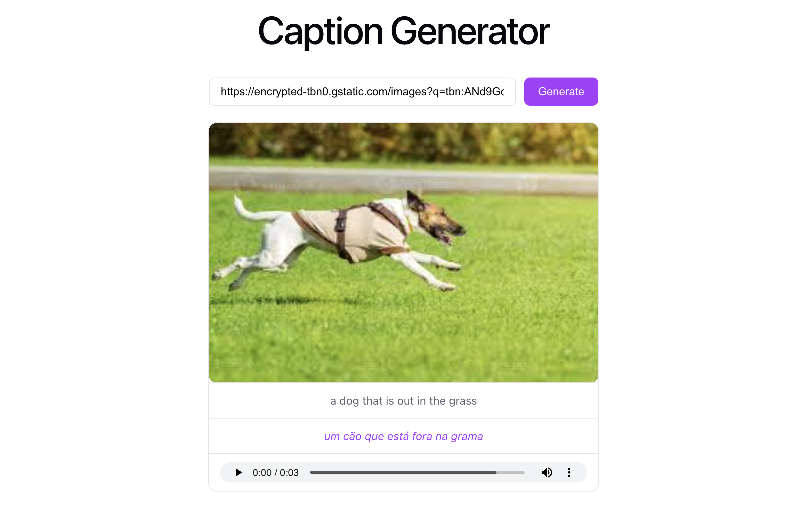

# AI App — Caption Generator

An AI-powered image captioning app that generates a caption from an image URL, translates it to Brazilian Portuguese, and converts the translation to speech.



---

## What it does

1. **Paste an image URL** into the input field
2. **Caption** — a vision model (`Xenova/vit-gpt2-image-captioning`) runs in-browser via `@huggingface/transformers` and generates an English caption
3. **Translate** — the caption is sent to `server_node`, which uses `Xenova/nllb-200-distilled-600M` to translate it from English to Brazilian Portuguese
4. **Text-to-speech** — the translated text is sent to `server_python`, which uses Bark (`suno/bark-small`) to generate a WAV audio file, returned as a playable audio element

---

## Architecture

```
┌─────────────────────────────────────────────┐
│               Browser (Vite + React)        │
│                                             │
│  ┌──────────────────────────────────────┐   │
│  │  ImageCaptioner (transformers.js)    │   │
│  │  vit-gpt2-image-captioning (ONNX)    │   │
│  └──────────────────────────────────────┘   │
│          │ caption (EN)                     │
│          ▼                                  │
│  POST http://localhost:3000/translate       │
│          │ translated text (PT-BR)          │
│          ▼                                  │
│  POST http://localhost:5001/text-to-audio   │
│          │ audio file path                  │
│          ▼                                  │
│  GET  http://localhost:5001/audio/<id>.wav  │
└─────────────────────────────────────────────┘
         │                        │
         ▼                        ▼
┌─────────────────┐    ┌─────────────────────┐
│   server_node   │    │    server_python    │
│   Express :3000 │    │    Flask :5001      │
│                 │    │                     │
│  nllb-200       │    │  Bark (suno/bark-   │
│  (translation)  │    │  small) TTS model   │
└─────────────────┘    └─────────────────────┘
```

---

## Project structure

```
ai-app/
├── compose.yaml           # Docker Compose (server_node + server_python)
├── front/                 # React + Vite frontend
│   ├── src/
│   │   ├── App.jsx
│   │   ├── models/
│   │   │   ├── api.ts          # API calls (caption, translate, audio)
│   │   │   └── ImageCaptioner.ts  # HuggingFace transformers.js pipeline
│   └── vite.config.js
├── server_node/           # Express translation service
│   ├── Dockerfile
│   ├── index.js
│   └── models/
│       ├── api.js
│       └── Translator.js
└── server_python/         # Flask text-to-speech service
    ├── Dockerfile
    ├── main.py
    ├── models/
    │   ├── api.py
    │   └── text_to_audio.py
    └── utils/
        └── __init__.py
```

---

## Local setup

### Prerequisites

- Node.js 20+
- Python 3.13+
- [uv](https://docs.astral.sh/uv/getting-started/installation/)
- A [HuggingFace token](https://huggingface.co/settings/tokens) with read access

---

### 1. Frontend

```bash
cd front
npm install
```

Create `front/.env`:

```env
VITE_HF_TOKEN=hf_your_token_here
```

```bash
npm run dev
```

Runs at `http://localhost:5173`.

---

### 2. server_node (translation)

```bash
cd server_node
npm install
node index.js
```

Runs at `http://localhost:3000`.

---

### 3. server_python (text-to-speech)

```bash
cd server_python
uv run -- flask --app main.py run
```

Runs at `http://127.0.0.1:5000`.

---

## Running with Docker

Starts all three services:

```bash
docker compose up
```

| Container     | Host port |
|---------------|-----------|
| front         | 5173      |
| server_node   | 3000      |
| server_python | 5001      |

App available at `http://localhost:5173`.
